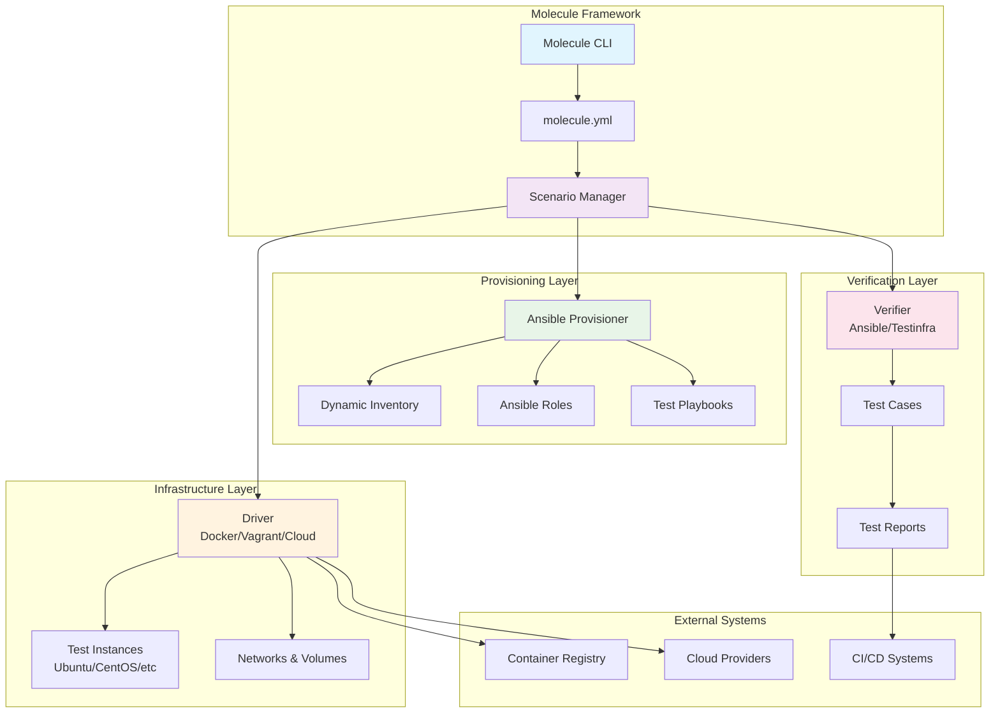
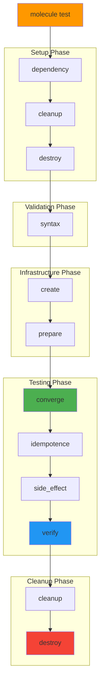
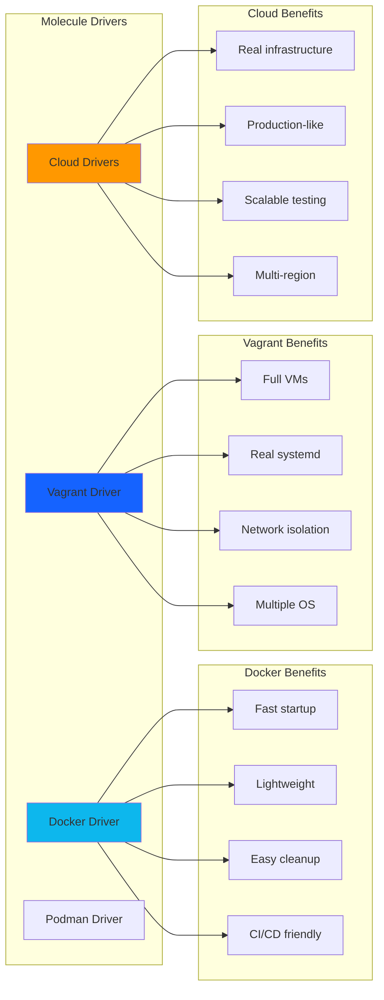
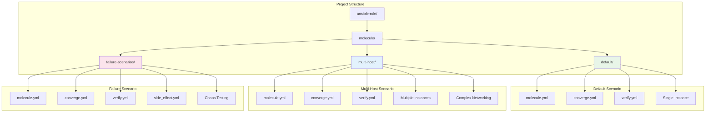
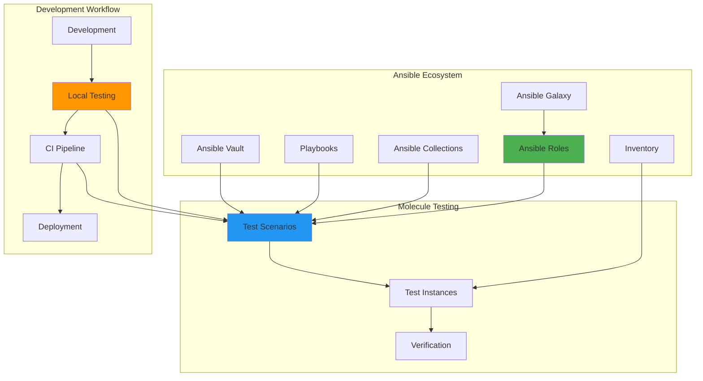
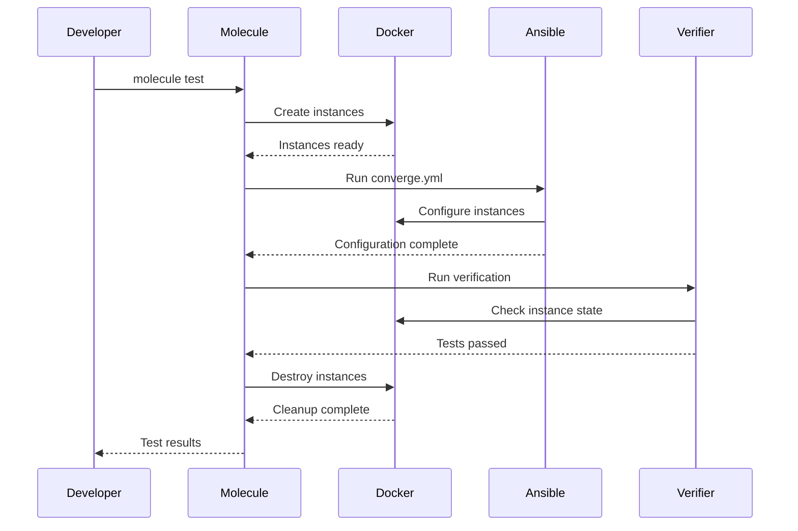
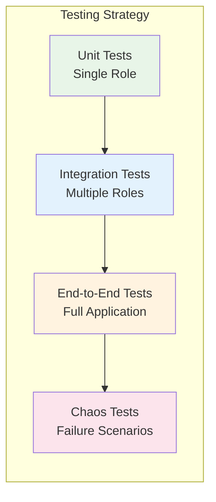
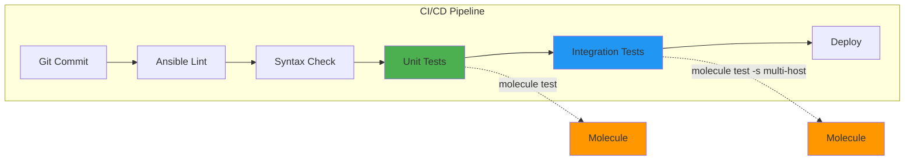

# 🧪 Understanding Molecule: The Complete Architecture Guide

This guide explains how Molecule works with Ansible, covering concepts, architecture, and practical implementation with visual diagrams.

## 📋 Table of Contents
1. [What is Molecule?](#what-is-molecule)
2. [Core Concepts](#core-concepts)
3. [Molecule Architecture](#molecule-architecture)
4. [Test Sequence Flow](#test-sequence-flow)
5. [Driver Systems](#driver-systems)
6. [Scenarios and Testing](#scenarios-and-testing)
7. [Integration with Ansible](#integration-with-ansible)
8. [Practical Examples](#practical-examples)
9. [Best Practices](#best-practices)

## 🎯 What is Molecule?

**Molecule** is a testing framework designed to aid in the development and testing of Ansible roles. It provides support for testing with multiple instances, operating systems, and distributions, virtualization providers, test frameworks, and testing scenarios.

### Key Benefits
- **Automated Testing**: Eliminates manual testing of Ansible roles
- **Multiple Platforms**: Test across different OS distributions
- **CI/CD Integration**: Seamless integration with continuous integration
- **Scenario-Based**: Support for complex testing scenarios
- **Infrastructure as Code**: Treat your tests as code

## 🏗️ Core Concepts

### 1. **Molecule Scenarios**
A scenario is a complete testing environment that defines:
- Infrastructure (instances, networks, volumes)
- Provisioning (how to set up the test environment)
- Testing steps (what tests to run)
- Cleanup procedures

### 2. **Drivers**
Drivers manage the lifecycle of test instances:
- **Docker**: Containerized testing (fast, lightweight)
- **Vagrant**: VM-based testing
- **Cloud Providers**: AWS, GCP, Azure testing
- **Podman**: Alternative container runtime

### 3. **Provisioners**
Handle the configuration management:
- **Ansible**: Primary provisioner for role testing
- **Shell**: Simple script-based provisioning

### 4. **Verifiers**
Validate that the system is in the expected state:
- **Ansible**: Built-in verification tasks
- **Testinfra**: Python-based infrastructure testing
- **Goss**: YAML-based testing framework

## 🏛️ Molecule Architecture



## 🔄 Test Sequence Flow

Molecule follows a specific sequence when running tests. Understanding this flow is crucial for effective testing.



### Detailed Step Breakdown

| Step | Description | Purpose |
|------|-------------|---------|
| **dependency** | Install role dependencies | Ensure all required roles/collections are available |
| **cleanup** | Clean up previous test artifacts | Start with clean slate |
| **destroy** | Destroy existing test instances | Remove any leftover infrastructure |
| **syntax** | Check Ansible syntax | Catch syntax errors early |
| **create** | Create test instances | Provision testing infrastructure |
| **prepare** | Prepare instances for testing | Install dependencies, configure base system |
| **converge** | Run the role being tested | Execute the main Ansible role |
| **idempotence** | Run role again to check idempotence | Ensure role doesn't make unnecessary changes |
| **side_effect** | Run additional side effect playbooks | Test interactions and dependencies |
| **verify** | Run verification tests | Validate the system is in expected state |
| **cleanup** | Clean up test artifacts | Remove temporary files |
| **destroy** | Destroy test instances | Clean up infrastructure |

## 🚗 Driver Systems

Different drivers provide different testing environments and capabilities.



### Driver Comparison

| Feature | Docker | Vagrant | Cloud |
|---------|--------|---------|-------|
| **Speed** | ⚡ Very Fast | 🐌 Slow | 🚀 Fast |
| **Resource Usage** | 💚 Low | 🔴 High | 💛 Variable |
| **Isolation** | 💛 Process | 💚 Full VM | 💚 Full VM |
| **Systemd Support** | 🔴 Limited | 💚 Full | 💚 Full |
| **Networking** | 💛 Limited | 💚 Full | 💚 Full |
| **Cost** | 💚 Free | 💚 Free | 🔴 Paid |
| **CI/CD** | 💚 Excellent | 💛 Good | 💚 Excellent |

## 🎭 Scenarios and Testing

Molecule supports multiple scenarios for different testing needs.



## 🤝 Integration with Ansible

Molecule integrates deeply with Ansible, leveraging its full ecosystem.



### Ansible Integration Points

1. **Role Testing**: Primary use case - testing individual Ansible roles
2. **Playbook Testing**: Testing complete playbooks and their interactions
3. **Collection Testing**: Testing entire Ansible collections
4. **Dependency Management**: Leveraging Ansible Galaxy for dependencies
5. **Inventory Management**: Dynamic inventory generation for test instances
6. **Variable Management**: Integration with Ansible's variable system
7. **Vault Integration**: Secure handling of sensitive test data

## 🏗️ Practical Examples

### Example 1: Simple Role Testing

```yaml
# molecule/default/molecule.yml
---
dependency:
  name: galaxy
driver:
  name: docker
platforms:
  - name: ubuntu-test
    image: ubuntu:22.04
    pre_build_image: true
provisioner:
  name: ansible
verifier:
  name: ansible
```

### Example 2: Multi-Host Testing

```yaml
# molecule/multi-host/molecule.yml
---
dependency:
  name: galaxy
driver:
  name: docker
platforms:
  - name: web-server
    image: ubuntu:22.04
    groups:
      - web_servers
  - name: db-server
    image: ubuntu:22.04
    groups:
      - database_servers
  - name: lb-server
    image: ubuntu:22.04
    groups:
      - load_balancers
provisioner:
  name: ansible
  inventory:
    group_vars:
      all:
        environment_type: testing
verifier:
  name: ansible
```

### Example 3: Complex Scenario Flow



## 💡 Best Practices

### 1. **Scenario Design**



### 2. **Resource Management**

- **Use appropriate drivers**: Docker for speed, Vagrant for completeness
- **Manage instance lifecycle**: Clean up resources properly
- **Optimize images**: Use pre-built images when possible
- **Resource limits**: Set appropriate CPU/memory limits

### 3. **Test Organization**

```yaml
# Good: Organized test structure
molecule/
├── default/           # Basic functionality
├── multi-host/       # Integration testing
├── failure/          # Failure scenarios
└── performance/      # Performance testing
```

### 4. **CI/CD Integration**



### 5. **Testing Patterns**

#### Idempotence Testing
```yaml
# verify.yml - Check idempotence
- name: Run role again to check idempotence
  include_role:
    name: my-role
  register: second_run

- name: Verify idempotence
  assert:
    that:
      - not second_run.changed
    fail_msg: "Role is not idempotent"
```

#### State Verification
```yaml
# verify.yml - Check final state
- name: Verify service is running
  service:
    name: my-service
  register: service_status

- name: Check service status
  assert:
    that:
      - service_status.status.ActiveState == "active"
```

### 6. **Performance Optimization**

| Technique | Description | Benefit |
|-----------|-------------|---------|
| **Pre-built Images** | Use images with pre-installed packages | Faster startup |
| **Parallel Testing** | Run multiple scenarios simultaneously | Reduced test time |
| **Selective Testing** | Only test changed components | Faster feedback |
| **Image Caching** | Cache Docker images locally | Faster subsequent runs |

## 🔧 Advanced Features

### Custom Drivers
```python
# custom_driver.py
from molecule.driver import base

class CustomDriver(base.Driver):
    def create(self):
        # Custom instance creation logic
        pass
        
    def destroy(self):
        # Custom cleanup logic
        pass
```

### Dynamic Inventory
```yaml
# molecule.yml
provisioner:
  name: ansible
  inventory:
    host_vars:
      instance:
        ansible_user: ubuntu
    group_vars:
      all:
        custom_var: value
```

### Custom Verifiers
```python
# custom_verifier.py
import testinfra

def test_service_running(host):
    service = host.service("nginx")
    assert service.is_running
    assert service.is_enabled
```

## 🎯 Conclusion

Molecule provides a powerful, flexible framework for testing Ansible roles and playbooks. By understanding its architecture and following best practices, you can:

- **Ensure Quality**: Catch issues before production
- **Increase Confidence**: Validate changes across multiple platforms
- **Accelerate Development**: Automated testing reduces manual effort
- **Improve Reliability**: Consistent testing leads to more reliable deployments

### Key Takeaways

1. **Choose the right driver** for your testing needs
2. **Design comprehensive scenarios** covering happy paths and failures
3. **Leverage Ansible's ecosystem** for maximum integration
4. **Automate testing** in your CI/CD pipeline
5. **Follow testing best practices** for maintainable tests

Molecule transforms infrastructure testing from a manual, error-prone process into an automated, reliable part of your development workflow. 🚀