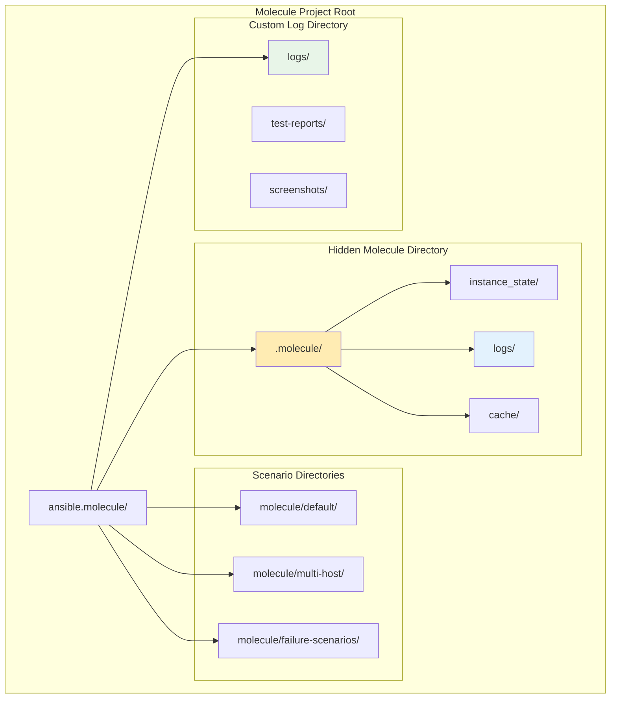

# 📊 Test Results and Logging Guide

This comprehensive guide explains where Molecule stores test results, how to interpret test outcomes, and how to effectively debug issues using logs and reports.

## 📋 Table of Contents
1. [Log Storage Locations](#log-storage-locations)
2. [Test Result Formats](#test-result-formats)
3. [Interpreting Test Outcomes](#interpreting-test-outcomes)
4. [Debug and Troubleshooting](#debug-and-troubleshooting)
5. [Log Analysis Tools](#log-analysis-tools)
6. [CI/CD Integration](#cicd-integration)
7. [Best Practices](#best-practices)

## 📁 Log Storage Locations

### Default Molecule Log Locations



### File System Structure

```bash
ansible.molecule/
├── .molecule/                    # Hidden Molecule directory
│   ├── default/                  # Per-scenario state
│   │   ├── ansible_inventory     # Generated inventory
│   │   ├── instance_config.yml   # Instance configuration
│   │   └── state.yml            # Scenario state
│   ├── multi-host/
│   │   ├── ansible_inventory
│   │   ├── instance_config.yml
│   │   └── state.yml
│   └── logs/                     # Molecule execution logs
│       ├── molecule.log          # Main log file
│       ├── ansible.log           # Ansible execution logs
│       └── docker.log           # Docker driver logs
├── logs/                        # Custom application logs
│   ├── test-results.log         # Test execution results
│   ├── happy-path-test-report-*.html
│   ├── failure-test-report-*.html
│   └── molecule-test-*.log
└── molecule/
    ├── default/
    ├── multi-host/
    └── failure-scenarios/
```

## 📝 Test Result Formats

### 1. Console Output

Molecule provides real-time console output with color-coded results:

```bash
# Successful step
✅ TASK [common : Update apt cache] ****************************
ok: [ubuntu-instance]

# Failed step
❌ TASK [haproxy : Install HAProxy package] ********************
fatal: [ubuntu-instance]: FAILED! => {
    "msg": "Package haproxy not found"
}

# Changed step
🔄 TASK [haproxy : Generate HAProxy configuration] *************
changed: [ubuntu-instance]

# Skipped step
⏭️  TASK [haproxy : Configure SSL] *******************************
skipping: [ubuntu-instance]
```

### 2. YAML Output Format

When using `ANSIBLE_STDOUT_CALLBACK=yaml`, output is structured:

```yaml
PLAY [Converge] ****************************************************************

TASK [Gathering Facts] *********************************************************
ok: [haproxy-01] => {
    "ansible_facts": {
        "ansible_architecture": "x86_64",
        "ansible_distribution": "Ubuntu",
        "ansible_distribution_version": "22.04"
    },
    "changed": false
}

TASK [common : Install common packages] ***************************************
changed: [haproxy-01] => {
    "cache_updated": true,
    "cache_update_time": 1704123456,
    "changed": true,
    "stderr": "",
    "stderr_lines": [],
    "stdout": "Reading package lists...\nBuilding dependency tree..."
}
```

### 3. JSON Output Format

For programmatic analysis, use JSON format:

```json
{
    "plays": [
        {
            "play": {
                "name": "Converge",
                "id": "00000000-0000-0000-0000-000000000000"
            },
            "tasks": [
                {
                    "task": {
                        "name": "common : Install common packages"
                    },
                    "hosts": {
                        "haproxy-01": {
                            "changed": true,
                            "stdout": "Package installed successfully",
                            "stderr": "",
                            "rc": 0,
                            "start": "2024-01-01 10:00:00",
                            "end": "2024-01-01 10:00:30"
                        }
                    }
                }
            ]
        }
    ]
}
```

## 🔍 Interpreting Test Outcomes

### Test Sequence Results


### Common Test Result Patterns

#### 1. **Successful Test Run**
```bash
INFO     default scenario test matrix: dependency, cleanup, destroy, syntax, create, prepare, converge, idempotence, side_effect, verify, cleanup, destroy
INFO     Performing prerun with role_name_check=0...
INFO     Set ANSIBLE_LIBRARY=/home/user/.cache/ansible-compat/b984a4/modules:/home/user/.ansible/plugins/modules:/usr/share/ansible/plugins/modules
INFO     Set ANSIBLE_COLLECTIONS_PATH=/home/user/.cache/ansible-compat/b984a4/collections:/home/user/.ansible/collections:/usr/share/ansible/collections
INFO     Set ANSIBLE_ROLES_PATH=/home/user/.cache/ansible-compat/b984a4/roles:/home/user/.ansible/roles:/usr/share/ansible/roles:/etc/ansible/roles
INFO     Running default > dependency
WARNING  Skipping, missing the requirements file.
INFO     Running default > cleanup
WARNING  Skipping, cleanup playbook not configured.
INFO     Running default > destroy
INFO     Running default > syntax
INFO     Running default > create
INFO     Running default > prepare
WARNING  Skipping, prepare playbook not configured.
INFO     Running default > converge
INFO     Running default > idempotence
INFO     Running default > side_effect
WARNING  Skipping, side effect playbook not configured.
INFO     Running default > verify
INFO     Running default > cleanup
WARNING  Skipping, cleanup playbook not configured.
INFO     Running default > destroy
```

#### 2. **Failed Test Run**
```bash
INFO     default scenario test matrix: dependency, cleanup, destroy, syntax, create, prepare, converge, idempotence, side_effect, verify, cleanup, destroy
INFO     Running default > dependency
INFO     Running default > cleanup
INFO     Running default > destroy
INFO     Running default > syntax
INFO     Running default > create
INFO     Running default > prepare
INFO     Running default > converge

PLAY [Converge] ****************************************************************

TASK [Gathering Facts] *********************************************************
ok: [instance]

TASK [haproxy : Install HAProxy package] **************************************
fatal: [instance]: FAILED! => {"changed": false, "msg": "No package matching 'haproxy' found available, installed or updated", "rc": 126, "results": ["No package matching 'haproxy' found available, installed or updated"]}

PLAY RECAP *********************************************************************
instance                   : ok=1    changed=0    unreachable=0    failed=1

CRITICAL Ansible return code was 2, command was: ['ansible-playbook', '--inventory', '/tmp/.../ansible_inventory', '--skip-tags', 'molecule-notest,notest', '/tmp/.../converge.yml']
WARNING  An error occurred during the test sequence action: 'converge'. Cleaning up.
INFO     Running default > cleanup
WARNING  Skipping, cleanup playbook not configured.
INFO     Running default > destroy
```

#### 3. **Idempotence Failure**
```bash
INFO     Running default > idempotence

PLAY [Converge] ****************************************************************

TASK [Gathering Facts] *********************************************************
ok: [instance]

TASK [haproxy : Generate HAProxy configuration] *******************************
changed: [instance]

PLAY RECAP *********************************************************************
instance                   : ok=2    changed=1    unreachable=0    failed=0

CRITICAL Idempotence test failed because of the following tasks:
* [instance] => haproxy : Generate HAProxy configuration

WARNING  An error occurred during the test sequence action: 'idempotence'. Cleaning up.
```

## 🔧 Debug and Troubleshooting

### Debug Logging Levels

```bash
# Enable different debug levels
molecule test --debug                    # Full debug output
molecule test -v                         # Verbose Ansible output
molecule test -vv                        # More verbose
molecule test -vvv                       # Maximum verbosity

# Combine debug flags
molecule test --debug -vvv               # Maximum debugging
```

### Custom Logging Configuration

Create a custom logging configuration:

```python
# logging.conf
[loggers]
keys=root,molecule

[handlers]
keys=console,file

[formatters]
keys=detailed

[logger_root]
level=INFO
handlers=console

[logger_molecule]
level=DEBUG
handlers=file
qualname=molecule

[handler_console]
class=StreamHandler
level=INFO
formatter=detailed
args=(sys.stdout,)

[handler_file]
class=FileHandler
level=DEBUG
formatter=detailed
args=('molecule-debug.log', 'w')

[formatter_detailed]
format=%(asctime)s - %(name)s - %(levelname)s - %(message)s
```

### Log Analysis Commands

```bash
# Real-time log monitoring
tail -f .molecule/logs/molecule.log

# Search for specific errors
grep -i "error\|fatal\|failed" .molecule/logs/molecule.log

# Filter by test step
grep "Running.*>" .molecule/logs/molecule.log

# Show only changed tasks
grep "changed:" .molecule/logs/ansible.log

# Extract timing information
grep "PLAY RECAP" -A 10 .molecule/logs/ansible.log
```

## 🛠️ Log Analysis Tools

### 1. **Built-in Analysis**

```bash
# Show molecule logs with color
molecule logs

# Show logs for specific scenario
molecule logs -s multi-host

# Show logs for specific host
molecule logs -h haproxy-01
```

### 2. **Custom Log Parser**

Create a script to parse test results:

```python
#!/usr/bin/env python3
# parse_test_results.py

import re
import json
from datetime import datetime

def parse_molecule_log(log_file):
    """Parse Molecule log file and extract test results"""
    
    results = {
        'timestamp': datetime.now().isoformat(),
        'scenarios': {},
        'summary': {
            'total_tests': 0,
            'passed': 0,
            'failed': 0,
            'errors': []
        }
    }
    
    current_scenario = None
    current_step = None
    
    with open(log_file, 'r') as f:
        for line in f:
            # Extract scenario information
            scenario_match = re.search(r'Running (\w+) > (\w+)', line)
            if scenario_match:
                current_scenario = scenario_match.group(1)
                current_step = scenario_match.group(2)
                
                if current_scenario not in results['scenarios']:
                    results['scenarios'][current_scenario] = {
                        'steps': {},
                        'status': 'running'
                    }
                
                results['scenarios'][current_scenario]['steps'][current_step] = {
                    'status': 'running',
                    'started_at': extract_timestamp(line)
                }
            
            # Extract error information
            if 'CRITICAL' in line or 'FAILED' in line or 'fatal:' in line:
                error = {
                    'level': 'critical' if 'CRITICAL' in line else 'error',
                    'message': line.strip(),
                    'timestamp': extract_timestamp(line),
                    'scenario': current_scenario,
                    'step': current_step
                }
                results['summary']['errors'].append(error)
                
                if current_scenario and current_step:
                    results['scenarios'][current_scenario]['steps'][current_step]['status'] = 'failed'
                    results['scenarios'][current_scenario]['status'] = 'failed'
    
    # Calculate summary statistics
    for scenario in results['scenarios'].values():
        results['summary']['total_tests'] += len(scenario['steps'])
        if scenario['status'] == 'failed':
            results['summary']['failed'] += 1
        else:
            results['summary']['passed'] += 1
    
    return results

def extract_timestamp(log_line):
    """Extract timestamp from log line"""
    timestamp_match = re.search(r'\d{4}-\d{2}-\d{2} \d{2}:\d{2}:\d{2}', log_line)
    return timestamp_match.group(0) if timestamp_match else None

def generate_html_report(results):
    """Generate HTML test report"""
    
    html_template = """
    <!DOCTYPE html>
    <html>
    <head>
        <title>Molecule Test Results</title>
        <style>
            body { font-family: Arial, sans-serif; margin: 20px; }
            .summary { background: #f5f5f5; padding: 15px; border-radius: 5px; }
            .scenario { margin: 20px 0; border: 1px solid #ddd; border-radius: 5px; }
            .scenario-header { background: #e3f2fd; padding: 10px; font-weight: bold; }
            .steps { padding: 10px; }
            .step { margin: 5px 0; padding: 8px; border-radius: 3px; }
            .step.passed { background: #c8e6c9; }
            .step.failed { background: #ffcdd2; }
            .step.running { background: #fff3e0; }
            .errors { background: #ffebee; padding: 10px; margin: 10px 0; border-radius: 5px; }
        </style>
    </head>
    <body>
        <h1>Molecule Test Results</h1>
        <div class="summary">
            <h2>Summary</h2>
            <p><strong>Timestamp:</strong> {timestamp}</p>
            <p><strong>Total Scenarios:</strong> {total_scenarios}</p>
            <p><strong>Passed:</strong> {passed}</p>
            <p><strong>Failed:</strong> {failed}</p>
            <p><strong>Success Rate:</strong> {success_rate}%</p>
        </div>
        
        {scenarios_html}
        
        {errors_html}
    </body>
    </html>
    """
    
    # Calculate success rate
    total = results['summary']['passed'] + results['summary']['failed']
    success_rate = (results['summary']['passed'] / total * 100) if total > 0 else 0
    
    # Generate scenarios HTML
    scenarios_html = ""
    for scenario_name, scenario_data in results['scenarios'].items():
        steps_html = ""
        for step_name, step_data in scenario_data['steps'].items():
            step_status = step_data.get('status', 'unknown')
            steps_html += f'<div class="step {step_status}">{step_name}: {step_status}</div>'
        
        scenarios_html += f"""
        <div class="scenario">
            <div class="scenario-header">{scenario_name} - {scenario_data['status']}</div>
            <div class="steps">{steps_html}</div>
        </div>
        """
    
    # Generate errors HTML
    errors_html = ""
    if results['summary']['errors']:
        errors_html = '<div class="errors"><h2>Errors</h2>'
        for error in results['summary']['errors']:
            errors_html += f'<p><strong>{error["level"].upper()}:</strong> {error["message"]}</p>'
        errors_html += '</div>'
    
    return html_template.format(
        timestamp=results['timestamp'],
        total_scenarios=len(results['scenarios']),
        passed=results['summary']['passed'],
        failed=results['summary']['failed'],
        success_rate=round(success_rate, 2),
        scenarios_html=scenarios_html,
        errors_html=errors_html
    )

if __name__ == "__main__":
    import sys
    
    if len(sys.argv) != 2:
        print("Usage: python parse_test_results.py <log_file>")
        sys.exit(1)
    
    log_file = sys.argv[1]
    results = parse_molecule_log(log_file)
    
    # Save JSON results
    with open('test-results.json', 'w') as f:
        json.dump(results, f, indent=2)
    
    # Generate HTML report
    html_report = generate_html_report(results)
    with open('test-results.html', 'w') as f:
        f.write(html_report)
    
    print(f"Results saved to test-results.json and test-results.html")
    print(f"Summary: {results['summary']['passed']}/{results['summary']['passed'] + results['summary']['failed']} tests passed")
```

### 3. **Ansible Callback Plugins**

Create custom callback plugins for better logging:

```python
# callback_plugins/custom_logger.py

from ansible.plugins.callback import CallbackBase
import json
import os
from datetime import datetime

class CallbackModule(CallbackBase):
    """
    Custom callback plugin for detailed test logging
    """
    
    CALLBACK_VERSION = 2.0
    CALLBACK_TYPE = 'notification'
    CALLBACK_NAME = 'custom_logger'
    
    def __init__(self):
        super(CallbackModule, self).__init__()
        self.log_file = open('detailed-test-results.json', 'w')
        self.results = {
            'start_time': datetime.now().isoformat(),
            'plays': [],
            'stats': {}
        }
    
    def v2_playbook_on_play_start(self, play):
        self.current_play = {
            'name': play.get_name(),
            'start_time': datetime.now().isoformat(),
            'tasks': []
        }
    
    def v2_runner_on_ok(self, result):
        self._log_task_result('ok', result)
    
    def v2_runner_on_failed(self, result, ignore_errors=False):
        self._log_task_result('failed', result)
    
    def v2_runner_on_changed(self, result):
        self._log_task_result('changed', result)
    
    def v2_runner_on_skipped(self, result):
        self._log_task_result('skipped', result)
    
    def _log_task_result(self, status, result):
        task_result = {
            'task_name': result._task.get_name(),
            'host': result._host.get_name(),
            'status': status,
            'timestamp': datetime.now().isoformat(),
            'result': self._sanitize_result(result._result)
        }
        
        if hasattr(self, 'current_play'):
            self.current_play['tasks'].append(task_result)
    
    def v2_playbook_on_stats(self, stats):
        self.results['end_time'] = datetime.now().isoformat()
        self.results['stats'] = {
            host: {
                'ok': stats.ok[host],
                'changed': stats.changed[host],
                'failures': stats.failures[host],
                'unreachable': stats.unreachable[host],
                'skipped': stats.skipped[host]
            }
            for host in stats.processed.keys()
        }
        
        json.dump(self.results, self.log_file, indent=2)
        self.log_file.close()
    
    def _sanitize_result(self, result):
        """Remove sensitive information from results"""
        sanitized = {}
        for key, value in result.items():
            if key not in ['ansible_facts', 'invocation']:
                if isinstance(value, (str, int, bool, list, dict)):
                    sanitized[key] = value
        return sanitized
```

## 📈 Test Metrics and Reporting

### Key Metrics to Track


### Automated Report Generation

```bash
#!/bin/bash
# generate-test-report.sh

REPORT_DIR="test-reports"
TIMESTAMP=$(date +"%Y%m%d_%H%M%S")
REPORT_FILE="$REPORT_DIR/molecule-report-$TIMESTAMP.html"

mkdir -p $REPORT_DIR

# Run tests with JSON output
molecule test --format json > "$REPORT_DIR/raw-results-$TIMESTAMP.json" 2>&1

# Parse results
python3 parse_test_results.py "$REPORT_DIR/raw-results-$TIMESTAMP.json"

# Generate summary
echo "Test Report Generated: $REPORT_FILE"
echo "View with: open $REPORT_FILE"
```

## 🔗 CI/CD Integration

### GitHub Actions Integration

```yaml
# .github/workflows/molecule.yml
name: Molecule Tests

on: [push, pull_request]

jobs:
  test:
    runs-on: ubuntu-latest
    
    steps:
      - uses: actions/checkout@v3
      
      - name: Set up Python
        uses: actions/setup-python@v4
        with:
          python-version: '3.9'
      
      - name: Install dependencies
        run: |
          pip install molecule[docker] ansible
      
      - name: Run Molecule tests
        run: molecule test --format json > test-results.json
        continue-on-error: true
      
      - name: Parse test results
        run: python3 parse_test_results.py test-results.json
      
      - name: Upload test results
        uses: actions/upload-artifact@v3
        if: always()
        with:
          name: molecule-test-results
          path: |
            test-results.json
            test-results.html
            .molecule/logs/
      
      - name: Comment PR with results
        if: github.event_name == 'pull_request'
        uses: actions/github-script@v6
        with:
          script: |
            const fs = require('fs');
            const results = JSON.parse(fs.readFileSync('test-results.json', 'utf8'));
            const comment = `## Molecule Test Results
            
            **Summary:**
            - Total Tests: ${results.summary.total_tests}
            - Passed: ${results.summary.passed}
            - Failed: ${results.summary.failed}
            - Success Rate: ${(results.summary.passed / results.summary.total_tests * 100).toFixed(2)}%
            
            ${results.summary.errors.length > 0 ? '**Errors:**\n' + results.summary.errors.map(e => `- ${e.message}`).join('\n') : ''}
            `;
            
            github.rest.issues.createComment({
              issue_number: context.issue.number,
              owner: context.repo.owner,
              repo: context.repo.repo,
              body: comment
            });
```

## 💡 Best Practices

### 1. **Log Retention Strategy**

```bash
# Create log rotation configuration
# /etc/logrotate.d/molecule-logs
/path/to/ansible.molecule/logs/*.log {
    weekly
    rotate 4
    compress
    delaycompress
    missingok
    notifempty
    create 644 user group
}
```

### 2. **Structured Logging**

```python
# structured_logger.py
import logging
import json
from datetime import datetime

class StructuredLogger:
    def __init__(self, log_file='structured-test.log'):
        self.logger = logging.getLogger('molecule_tests')
        handler = logging.FileHandler(log_file)
        handler.setFormatter(logging.Formatter('%(message)s'))
        self.logger.addHandler(handler)
        self.logger.setLevel(logging.INFO)
    
    def log_test_start(self, scenario, step):
        self._log('test_start', {
            'scenario': scenario,
            'step': step,
            'timestamp': datetime.now().isoformat()
        })
    
    def log_test_result(self, scenario, step, status, details=None):
        self._log('test_result', {
            'scenario': scenario,
            'step': step,
            'status': status,
            'details': details,
            'timestamp': datetime.now().isoformat()
        })
    
    def _log(self, event_type, data):
        log_entry = {
            'event_type': event_type,
            'data': data
        }
        self.logger.info(json.dumps(log_entry))
```

### 3. **Test Result Archival**

```bash
#!/bin/bash
# archive-test-results.sh

ARCHIVE_DIR="test-archives/$(date +%Y/%m)"
mkdir -p "$ARCHIVE_DIR"

# Archive test results
tar -czf "$ARCHIVE_DIR/molecule-results-$(date +%Y%m%d_%H%M%S).tar.gz" \
    .molecule/logs/ \
    logs/ \
    test-results.* \
    *.html

# Clean up old logs (keep last 30 days)
find test-archives/ -type f -name "*.tar.gz" -mtime +30 -delete

echo "Test results archived to $ARCHIVE_DIR"
```

## 🎯 Conclusion

Understanding Molecule's logging and test result system is crucial for:

- **Debugging Issues**: Quickly identify and resolve problems
- **Performance Monitoring**: Track test execution performance over time
- **Quality Assurance**: Ensure tests are reliable and maintainable
- **Compliance**: Maintain audit trails for test executions
- **Continuous Improvement**: Analyze trends and optimize testing strategies

### Key Takeaways

1. **Know your log locations**: `.molecule/logs/` for execution logs, custom `logs/` for application logs
2. **Use structured logging**: JSON format for programmatic analysis
3. **Implement automated parsing**: Create scripts to extract meaningful insights
4. **Archive strategically**: Balance storage costs with debugging needs
5. **Integrate with CI/CD**: Automate report generation and result sharing

With proper logging and result interpretation, Molecule becomes not just a testing tool, but a comprehensive quality assurance platform for your infrastructure automation! 🚀